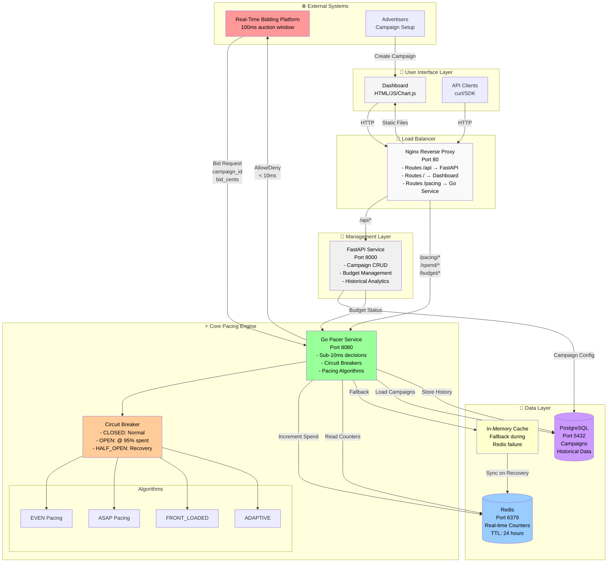

# 🏗️ Ad Campaign Budget Pacer - Complete System Diagram

## 📊 Full System Flow



## 🔄 Request Flow Sequences

### 1️⃣ Bid Decision Flow (< 10ms)

```
RTB Platform                  Pacer Service              Redis              Circuit Breaker
     |                             |                       |                      |
     |------ Bid Request --------->|                       |                      |
     |   {campaign_id, bid_cents}  |                       |                      |
     |                             |                       |                      |
     |                             |---Get Spent Today---->|                      |
     |                             |<------$4,500----------|                      |
     |                             |                       |                      |
     |                             |---Check Threshold---->|                      |
     |                             |                       |---Is 45% < 95%?----->|
     |                             |                       |<-----CLOSED----------|
     |                             |                       |                      |
     |                             |--Calculate Throttle-->|                      |
     |                             |  (EVEN: 0% throttle)  |                      |
     |                             |                       |                      |
     |<------ALLOW BID-------------|                       |                      |
     |      (< 10ms total)         |                       |                      |
```

### 2️⃣ Spend Tracking Flow

```
Winner Notification           Pacer Service              Redis              PostgreSQL
     |                             |                       |                      |
     |------Spend Update---------->|                       |                      |
     |  {campaign_id, spend_cents} |                       |                      |
     |                             |                       |                      |
     |                             |---INCR daily:camp-001->|                      |
     |                             |---INCR hourly:camp-001>|                      |
     |                             |                       |                      |
     |                             |----Store for History------------------------>|
     |                             |                       |                      |
     |<---------ACK----------------|                       |                      |
```

### 3️⃣ Circuit Breaker Trip Flow (at 95% threshold)

```
High Spending Period         Pacer Service          Circuit Breaker         Redis
     |                             |                      |                   |
     |------Bid Request----------->|                      |                   |
     |                             |--Get Spent---------->|                   |
     |                             |<----$9,501-----------|                   |
     |                             |                      |                   |
     |                             |--Check: 95.01% > 95%->|                   |
     |                             |<-------TRIP!---------|                   |
     |                             |   State → OPEN       |                   |
     |                             |                      |                   |
     |<------DENY BID--------------|                      |                   |
     |   "Circuit breaker open"    |                      |                   |
     |                             |                      |                   |
     === 30 seconds later ===      |                      |                   |
     |                             |--Timer Expired------>|                   |
     |                             |<--State → HALF_OPEN--|                   |
     |                             |                      |                   |
     |------Test Request---------->|                      |                   |
     |                             |--Allow 1 test bid--->|                   |
     |<------ALLOW (throttled)-----|                      |                   |
     |                             |                      |                   |
     |------Another Request------->|                      |                   |
     |                             |--Success count = 2--->|                   |
     |                             |<--State → CLOSED-----|                   |
     |<------ALLOW (90% throttle)--|                      |                   |
```

### 4️⃣ Redis Failover Flow

```
Normal Operation            Redis Fails              Degraded Mode           Redis Recovers
     |                          |                         |                        |
     |---Bid Request-->        |                         |                        |
     |<--Use Redis Data--       |                         |                        |
     |                          |                         |                        |
     |                     [Redis Down]                   |                        |
     |                          |                         |                        |
     |                          |---Bid Request---------->|                        |
     |                          |--Redis Timeout (100ms)->|                        |
     |                          |<--Switch to Memory------|                        |
     |                          |<--Conservative Decision-|                        |
     |                          |   (50% throttle)        |                        |
     |                          |                         |                        |
     |                          |---Track in Memory------>|                        |
     |                          |   {camp-001: $500}      |                        |
     |                          |                         |                        |
     |                          |                    [Redis Back Up]               |
     |                          |                         |----Health Check OK---->|
     |                          |                         |<---Sync Memory Data--->|
     |                          |                         |    MSET operations     |
     |                          |                         |<---Normal Mode-------->|
```

## 🎯 Component Responsibilities

### Pacer Service (Go) - Core Engine
```
Responsibilities:
├── Make bid decisions in < 10ms
├── Track spending in real-time
├── Enforce budget limits via circuit breaker
├── Implement 4 pacing algorithms
├── Handle 10,000+ QPS
└── Gracefully degrade during failures

Key Files:
├── /pacer-service/pacer/algorithm.go     - Pacing algorithms
├── /pacer-service/pacer/circuitbreaker.go - Circuit breaker logic
├── /pacer-service/pacer/tracker.go        - Spend tracking
└── /pacer-service/pacer/service.go        - HTTP handlers
```

### FastAPI (Python) - Management Layer
```
Responsibilities:
├── Campaign CRUD operations
├── Budget configuration
├── Historical analytics
├── Dashboard data API
└── Administrative functions

Endpoints:
├── GET    /campaigns              - List all campaigns
├── POST   /campaigns              - Create campaign
├── PUT    /campaigns/{id}         - Update campaign
├── DELETE /campaigns/{id}         - Delete campaign
└── GET    /budget/status/{id}     - Get budget status
└── GET    /analytics/performance  - Performance metrics
```

### Redis - Real-time State
```
Data Structure:
├── budget:day:camp-001:2024-01-15    → 450000 (cents spent today)
├── budget:hour:camp-001:2024-01-15-14 → 25000 (cents this hour)
├── throttle:camp-001                  → 0.25 (current throttle rate)
└── cb:state:camp-001                  → "OPEN" (circuit breaker state)

TTL Strategy:
├── Daily keys:  24 hours
├── Hourly keys: 2 hours
└── State keys:  1 hour
```

### PostgreSQL - Persistent Storage
```
Tables:
├── campaigns
│   ├── id (UUID)
│   ├── name
│   ├── daily_budget_cents
│   ├── total_budget_cents
│   ├── pacing_algorithm
│   ├── start_date
│   └── end_date
│
├── spend_history
│   ├── campaign_id
│   ├── timestamp
│   ├── spend_cents
│   └── impressions
│
└── performance_metrics
    ├── campaign_id
    ├── date
    ├── total_spent_cents
    ├── impressions
    ├── avg_latency_ms
    └── throttle_rate
```

## 📈 Performance Characteristics

### Latency Breakdown (P99 < 10ms requirement)
```
Operation                Time Budget
─────────────────────────────────────
Redis GET                    1ms
Circuit Breaker Check        0.1ms
Algorithm Calculation        0.5ms
JSON Parse/Response          0.5ms
Network RTT                  2ms
Buffer/Overhead             5.9ms
─────────────────────────────────────
TOTAL P99                   <10ms ✓
```

### Throughput Capacity
```
Component            Capacity    Bottleneck
─────────────────────────────────────────
Pacer Service        50,000 QPS  CPU
Redis               100,000 QPS  Network I/O
PostgreSQL           5,000 QPS   Disk I/O
Nginx               75,000 QPS   CPU
─────────────────────────────────────────
System Max          ~50,000 QPS  (Pacer CPU)
```

## 🔒 Failure Scenarios & Recovery

### Scenario 1: Redis Failure
```
Detection: Health check timeout (100ms)
Action:    Switch to in-memory cache
Impact:    Conservative pacing (50% throttle)
Recovery:  Auto-sync when Redis returns
Data Loss: None (memory preserved)
```

### Scenario 2: Circuit Breaker Trip
```
Trigger:   95% of daily budget spent
Action:    DENY all bids for 30 seconds
Recovery:  HALF_OPEN → test 2 bids → CLOSED
Impact:    Temporary bid blocking
Purpose:   Prevent budget overrun
```

### Scenario 3: PostgreSQL Failure
```
Detection: Connection timeout
Impact:    Cannot load new campaigns
Fallback:  Use cached campaign data
Recovery:  Reconnect and reload
Critical:  Existing campaigns continue
```

### Scenario 4: High Load Spike
```
Detection: Latency > 10ms
Action:    Increase throttle rate
Method:    Adaptive algorithm adjusts
Recovery:  Reduce throttle as load drops
Protection: Circuit breaker as last resort
```

## 🚀 Scaling Strategy

### Horizontal Scaling
```
┌─────────────┐     ┌─────────────┐     ┌─────────────┐
│  Pacer #1   │     │  Pacer #2   │     │  Pacer #3   │
│  Port 8080  │     │  Port 8081  │     │  Port 8082  │
└──────┬──────┘     └──────┬──────┘     └──────┬──────┘
       │                   │                   │
       └───────────────┬───┴───────────────────┘
                       │
              ┌────────▼────────┐
              │   Shared Redis  │
              │   Cluster       │
              └─────────────────┘
```

### Sharding Strategy
```
Campaign ID Hash → Shard Selection
├── Shard 1: Campaigns 0-33%
├── Shard 2: Campaigns 34-66%
└── Shard 3: Campaigns 67-100%
```

This comprehensive diagram shows how all components interact to deliver sub-10ms bid decisions while preventing budget overspending through circuit breakers and intelligent pacing algorithms.